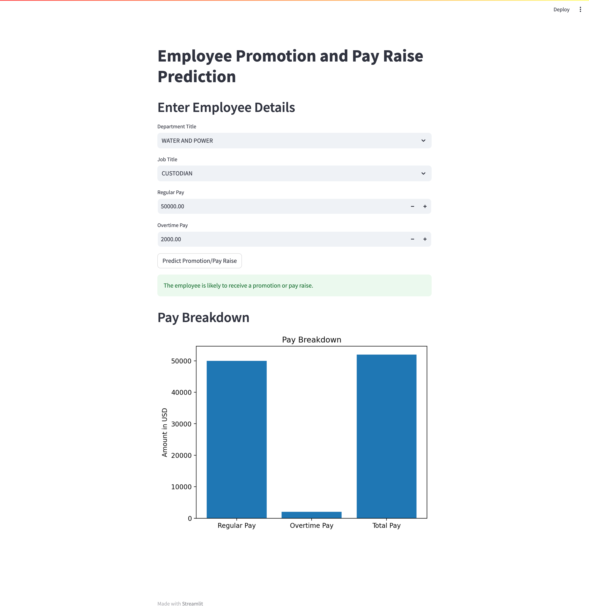

---

# Employee Promotion and Pay Raise Prediction

## Project Overview
This project focuses on predicting whether an employee will receive a promotion or pay raise based on key factors such as **department**, **job title**, **regular pay**, and **overtime pay**. By leveraging historical payroll data, the model provides insights that can aid HR professionals in making informed decisions about employee advancements and compensation adjustments.

## GitHub Repository

You can find the full project, including the code for the model and the Streamlit app, on my GitHub repository:  
[GitHub Repository](https://github.com/suhaasteja/employee-promotion-ML) 

## Model Details
The predictive model is built using a **Random Forest Classifier**, a versatile machine learning algorithm known for its robustness and accuracy in classification tasks. The model considers the following features:

- **Department Title**
- **Job Title**
- **Regular Pay**
- **Overtime Pay**

The target variable is a binary indicator representing whether an employee received a promotion or pay raise. This is determined by comparing the **Total Pay** to the sum of **Regular Pay** and **Overtime Pay**.

### Handling Class Imbalance with SMOTE
The dataset contained **676,292 records** and exhibited a significant class imbalance:

- **Class 0**: Employees who did not receive a promotion or pay raise.
- **Class 1**: Employees who received a promotion or pay raise.

To address this imbalance and improve the model's ability to correctly predict the minority class (Class 0), we employed **SMOTE (Synthetic Minority Over-sampling Technique)**. SMOTE works by creating synthetic examples of the minority class, resulting in a more balanced dataset. This enhances the model's performance by preventing it from becoming biased toward the majority class.

## Key Results
- **Model Accuracy**: 85%

### Performance Metrics:

- **Class 0 (No Promotion/Pay Raise)**:
  - **Precision**: 0.52
  - **Recall**: 0.79
  - **F1-Score**: 0.63

- **Class 1 (Promotion/Pay Raise)**:
  - **Precision**: 0.95
  - **Recall**: 0.86
  - **F1-Score**: 0.90

These results indicate that the model performs well, especially in predicting employees who receive promotions or pay raises. The use of SMOTE significantly improved the recall for Class 0, ensuring that the model does not overlook employees who might not receive a promotion or pay raise.

## Streamlit Web App

A **Streamlit web application** has been integrated to allow users to test the model and visualize key insights about employee pay and promotion likelihood. The web app provides an interactive interface where HR professionals can input an employee's details and receive a prediction of whether the employee is likely to receive a promotion or pay raise.

### Features:
- **Input Form**: Users can input key employee data such as **Department Title**, **Job Title**, **Regular Pay**, and **Overtime Pay**.
- **Prediction**: Based on the input data, the model predicts whether the employee is likely to receive a promotion or pay raise.
- **Pay Breakdown Visualization**: A **bar chart** shows the breakdown of **Regular Pay**, **Overtime Pay**, and **Total Pay**.

### Screenshot of the Streamlit UI:
 <!-- Replace with actual screenshot path -->

### How to Run the App:
1. Install **Streamlit**:
    ```bash
    pip install streamlit
    ```
2. Run the app:
    ```bash
    streamlit run streamlit_app.py
    ```

The Streamlit app allows for an easy and intuitive way to interact with the model and gain insights into employee pay and promotion likelihood.

## Conclusion
The **Employee Promotion and Pay Raise Prediction** model serves as a valuable tool for human resource management. By analyzing critical employee data, the model assists in identifying employees likely to advance or require compensation adjustments. The implementation of SMOTE effectively addresses class imbalance, enhancing the model's accuracy and reliability across different employee categories.

This project demonstrates the practical application of machine learning techniques in the HR domain, contributing to data-driven decision-making processes within organizations.


---
